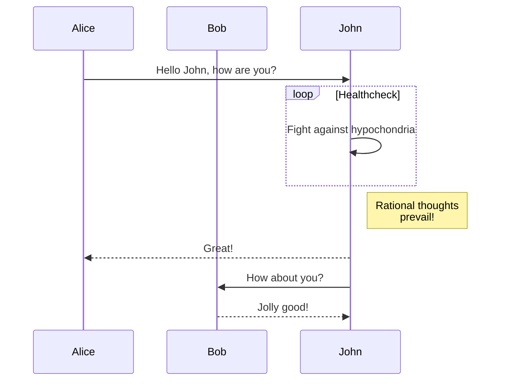

[Mermaid](https://mermaid-js.github.io/) 是一款基于 JavaScript 的绘图工具。利用 Mermaid 你可以使用文本和编码的方式绘制流程图、时序图、甘特图。


在使用 Mermaid 前，我曾经尝试过使用 PlantUML 进行绘图。因为基本没有 Markdown 编辑器原生支持 PlantUML，所以我采用 VS Code 外加 PlantUML 插件的方式进行绘图，但实际使用时存在如下问题：


1. 使用 PlantUML 绘制的流程图无法友好地与别人分享，即时是导出成 PNG 也会出现失真的问题。
2. 流程图通常需要与文本文档共同组合最终呈现给读者，但如果使用 PlantUML 绘图，对于未集成 PlantUML 的文档工具，只能将最终生成的图片贴到文档中，之后我们想再次编辑图片就成了一个难事。


基于这些原因，最终我放弃了使用 PlantUML。后来 [draw.io](https://www.draw.io/) 成为了我的主力绘图工具，不得不说 draw.io 是我目前使用过体验最好的绘图工具，并且由于公司的 Wiki 系统对 draw.io 有完善的集成，所以工作中我基本都会使用它来绘图。


工作之外， 当我使用 Markdown 进行写作时，我依然希望追求一种行云流水的写作感觉，文章里的文本和流程图最好一体化，方便日后再次编辑。后来惊喜地发现了 Mermaid，我日常使用的 [Typora](https://typora.io/) 编辑器，就对 Mermaid 支持得很好。


Hexo 博客框架也是支持渲染 Mermaid 流程图的，安装方式可见 [ hexo-filter-mermaid-diagrams](https://github.com/webappdevelp/hexo-filter-mermaid-diagrams) 。


以下是 Hexo 中直接渲染 Mermaid 的时序图效果
````

````


目前如果我使用的文档系统支持 draw.io， 我依然会优先使用 draw.io 绘图。 编写 Markdown 时我会使用 Mermaid 进行绘图。当要绘制复杂的流程图时，使用 Mermaid 是一种不错的选择，毕竟大家都不愿意把大部分时间花在调整流程图中各种元素的尺寸、对齐等问题上。
